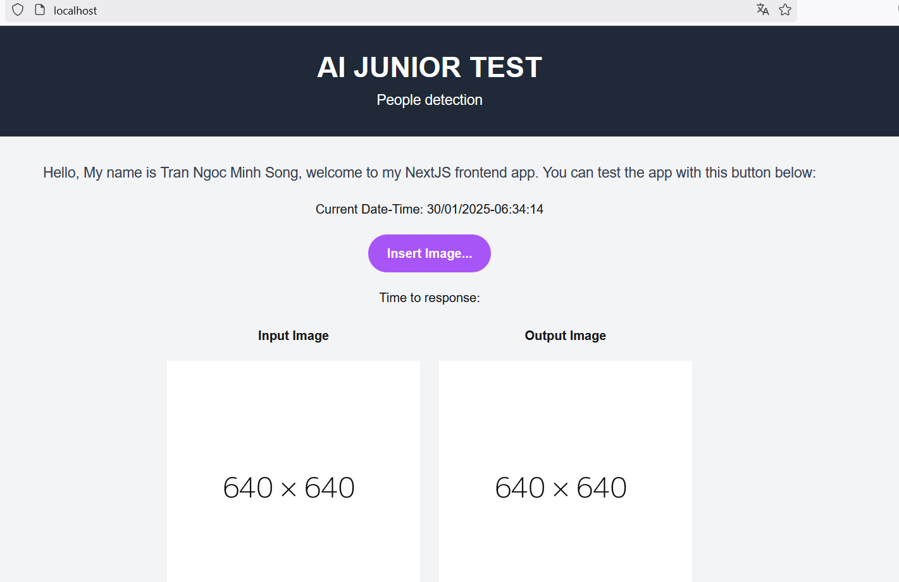
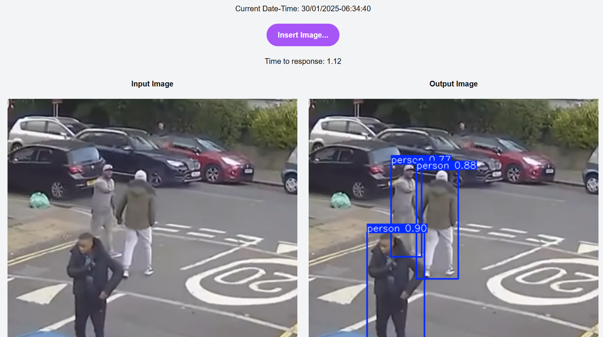
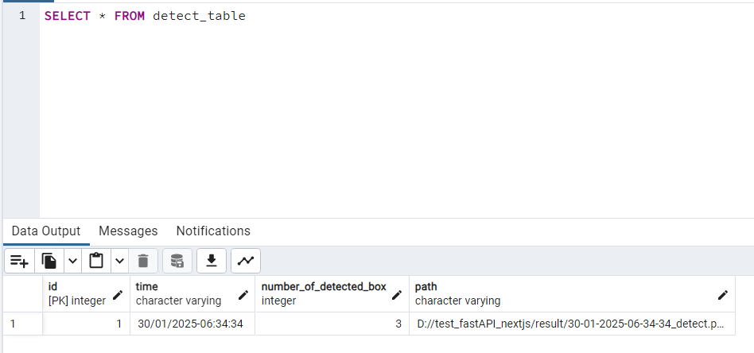
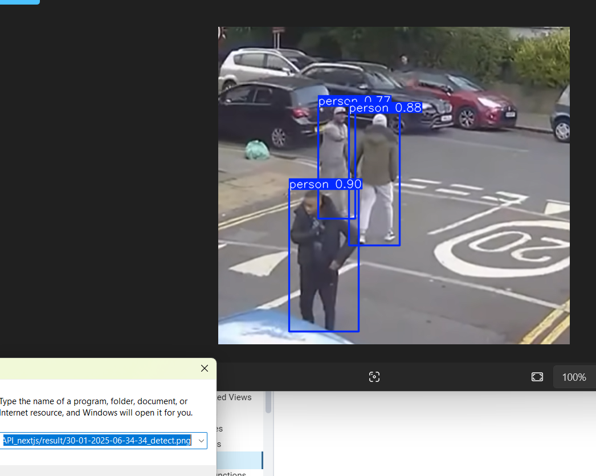

<h3><b>People Detection</b><h3>


<h6>Deployment with Docker:</h6>

You can try it with 
```
docker compose up --build -d
```
The docker-compose contains 3 service: Postgresql, frontend, backend and nginx(handle request for bridge network). In the docker-compose, I mount the result inside the container to current working directory.

With backend, I use nvcr.io/nvidia/tensorrt:23.06-py3 base image to help it run with tensorrt format for better performance

<h6>Frontend:</h6>

I use NextJS and do some basic function like: useEffect, useState, fetch data from backend, sharing variable between children components

<h6>Backend:</h6>

I use FastAPI for my backend, with sqlmodel to map data and communicate with database, and use StreamingResponse to handle image response to frontend

<h6>AI Inference:</h6>

I reused the pretrained model yolov8, and do some other process to optimize it for better performance. As first, I converted it to onnx on google colab. Then, I ran in the nvcr.io/nvidia/tensorrt container to used trtexec to convert it to tensorrt format. Finally, after testing all the converted models, I selected the TensorRT version with FP16 for the best performance.

<h6>Demo:</h6>

Access the webpage with localhost:



Insert image and get the response:



Now in database:



Enter the path in database to Window + R:


