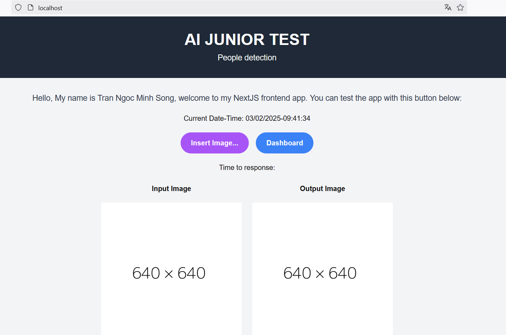
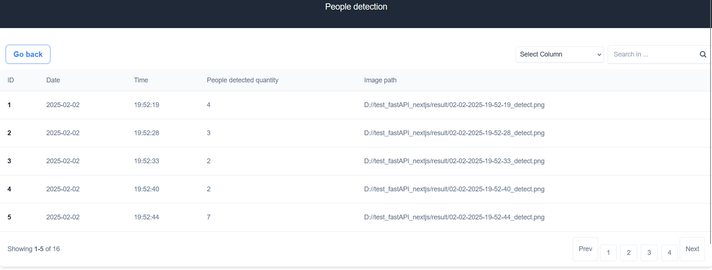
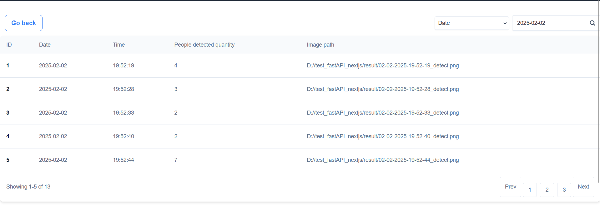
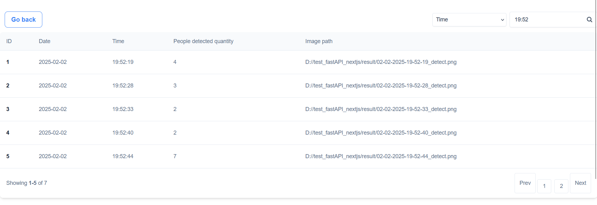

<h3><b>People Detection</b><h3>


<h6>Deployment with Docker:</h6>

You can try it with 
```
docker compose up --build -d
```
The docker-compose contains 4 service: Postgresql, frontend, backend and nginx(handle request for bridge network). In the docker-compose, I mount the result inside the container to current working directory.

With backend, I use nvcr.io/nvidia/tensorrt:23.06-py3 base image to help it run with tensorrt format for better performance

<h6>Frontend:</h6>

I use NextJS and do some basic function like: useEffect, useState, fetch data from backend, sharing variable between children components. Moreover, I use useRouter to navigate between 2 main page: ImageProcess and Dashboard for visualizing database

<h6>Backend:</h6>

I use FastAPI for my backend, with sqlalchemy to map data and communicate with database, and use StreamingResponse to handle image response to frontend

<h6>AI Inference:</h6>

I reused the pretrained model yolov8, and do some other process to optimize it for better performance. As first, I converted it into onnx on google colab. Then, I ran in the nvcr.io/nvidia/tensorrt container using trtexec command to convert it to tensorrt format. Finally, after testing all the converted models, I selected the TensorRT version with FP16 for the best performance.

<h6>Demo:</h6>

Access the webpage with localhost:



Insert image and wait for response:


Go to dashboard and check:



The dashboard has the pagination tab, every page has maximum of 5 elements. 

You can query the events you need on the search bar.
With date and quantity, it queries all elements have  date or quantity equals to input. 




With time query, if your input is just a number, it will be known as hour, and it will check from the hour:0:0 to hour:59:59, if your input's format is like 12:30, it will be known as hour:minute and it will check from hour:minute:00 to hour:minute:59

